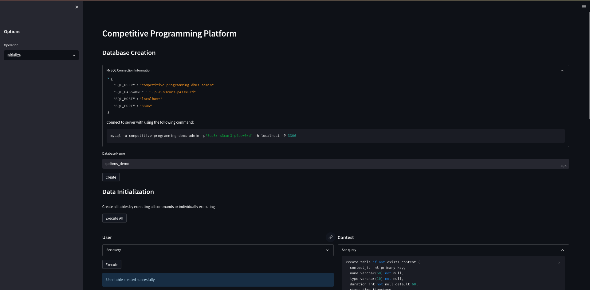
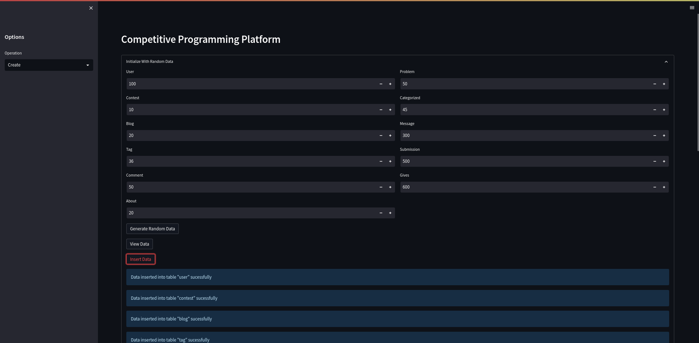
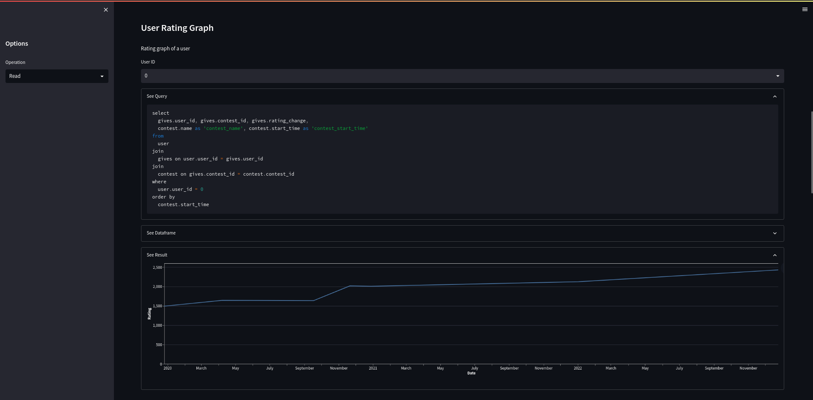
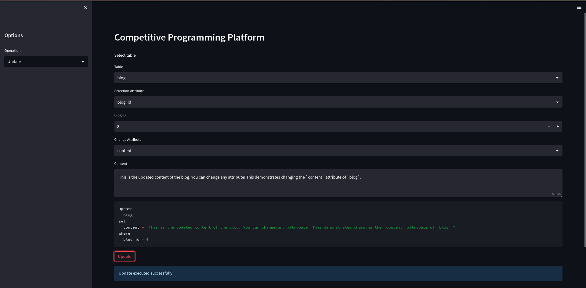
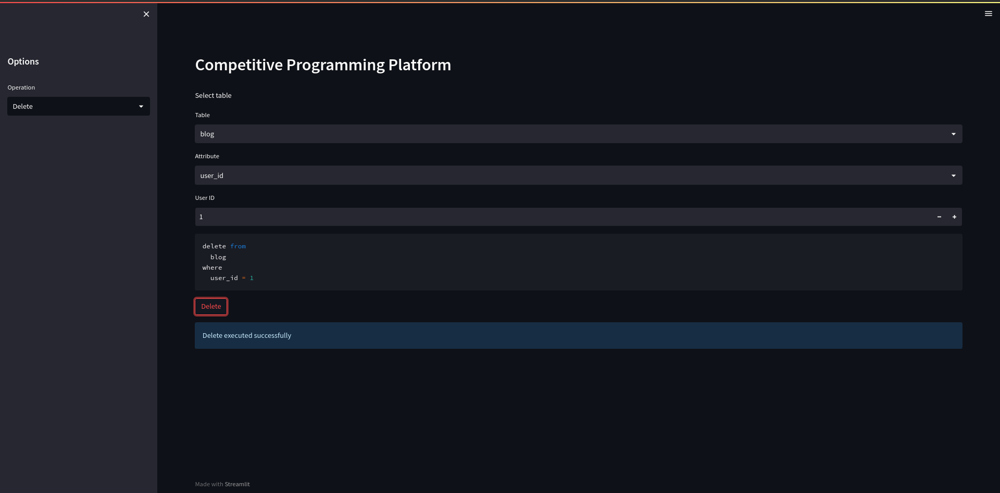
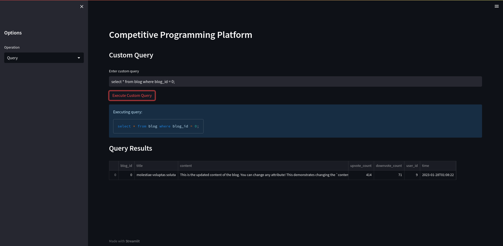
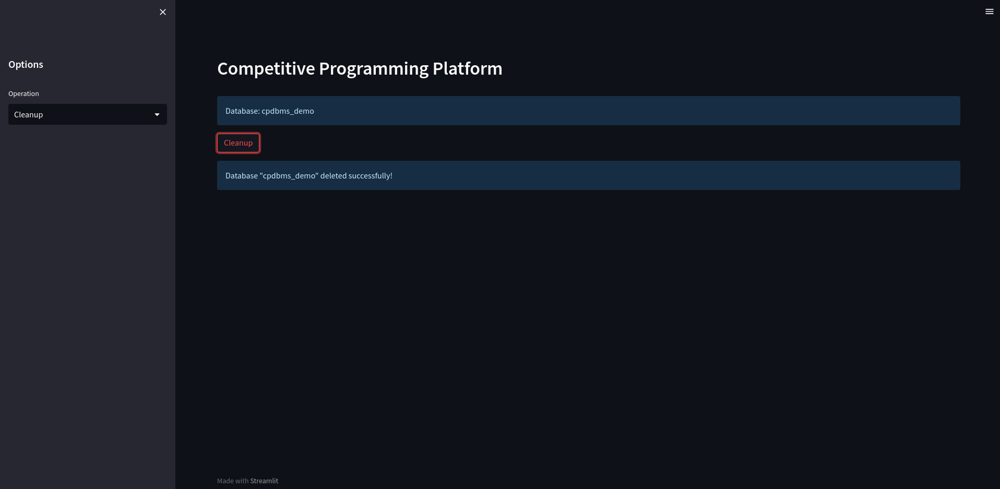

# Competitive Programming DBMS

Competitive Programming Database Management System.

### Run

Install MariaDB MySQL server (follow an online guide over the below commands preferably).

```
sudo apt update
sudo apt install -y mariadb-server
sudo systemctl start mariadb.service
sudo mysql_secure_installation
```

Make sure MySQL is working correctly. Execute commands in `setup.sql` and make sure to setup `config.py` based on the details of the user account you create.

Clone the repository and create a virtual environment. The application requires Python 3.10 or above.

```
git clone https://github.com/a-r-r-o-w/competitive-programming-dbms
cd competitive-programming-dbms

python3 -m venv .venv
source .venv/bin/activate
pip3 install -r requirements.txt

streamlit run src/app.py
```

### Gallery

**Initialize**



<br />

**Create**



<br />

**Read**



<br />

**Update**



<br />

**Delete**



<br />

**Query**



<br />

**Cleanup**


